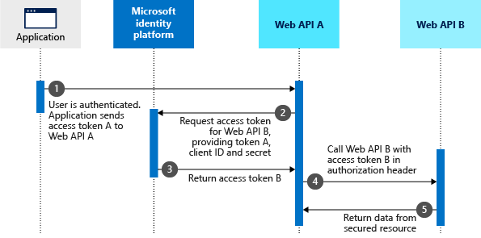
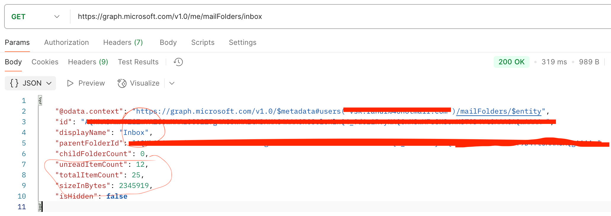

# Azure On-Behalf-Of flow Demo

## Ref:-

### Microsoft documentation
https://learn.microsoft.com/en-us/entra/identity-platform/v2-oauth2-on-behalf-of-flow

### Decode JWT token
1. https://jwt.ms
2. https://jwt.io

### Microsoft Graph Explorer
https://developer.microsoft.com/en-us/graph/graph-explorer 

https://learn.microsoft.com/en-us/graph/api/resources/mail-api-overview?view=graph-rest-1.0 

### Protocol Diagram

Assume that the user authenticated an application using the OAuth 2.0 authorization code grant flow or another sign-in flow. At this point, the application has an access token for API A (token A) with the user's claims and consent to access the middle-tier web API (API A). Now, API A needs to make an authenticated request to the downstream web API (API B).

The steps that follow constitute the OBO flow and are explained with the help of the following diagram.



1. The client application makes a request to API A with token A (with an aud claim of API A). 
2. API A authenticates to the Microsoft identity platform token issuance endpoint and requests a token to access API B. 
3. The Microsoft identity platform token issuance endpoint validates API A's credentials along with token A and issues the access token for API B (token B) to API A. 
4. Token B is set by API A in the authorization header of the request to API B. 
5. Data from the secured resource is returned by API B to API A, then to the client.


In this scenario, the middle-tier service has no user interaction to get the user's consent to access the downstream API. Therefore, the option to grant access to the downstream API is presented upfront as part of the consent step during authentication. To learn how to implement this in your app, see Gaining consent for the middle-tier application.

### Postman

#### Middle Tier token using 
Grab middle tier token using following curl 
1. client_id = client id of the app registered on https://entra.microsoft.com/ 
2. auth_code - received using `OAuth2.0 Authorization code grant flow`.

```curl
curl --location 'https://login.microsoftonline.com/common/oauth2/v2.0/token' \
--header 'Content-Type: application/x-www-form-urlencoded' \
--data-urlencode 'grant_type=authorization_code' \
--data-urlencode 'client_id=client_id' \
--data-urlencode 'scope=api://client_id/.default' \
--data-urlencode 'code=auth_code' \
--data-urlencode 'redirect_uri=http://localhost:8080/auth'
```

#### Downstream Token
Grab the downstream (graph) API access token using following curl

```curl
curl --location 'https://login.microsoftonline.com/common/oauth2/v2.0/token' \
--header 'Content-Type: application/x-www-form-urlencoded' \
--data-urlencode 'grant_type=urn:ietf:params:oauth:grant-type:jwt-bearer' \
--data-urlencode 'client_id=client_id' \
--data-urlencode 'client_secret=client_secret' \
--data-urlencode 'assertion=middle_tier_token' \
--data-urlencode 'scope=https://graph.microsoft.com/.default' \
--data-urlencode 'requested_token_use=on_behalf_of'
```

#### Graph API 
Call the required Graph API

E.g.;
```curl
curl --location 'https://graph.microsoft.com/v1.0/me/mailFolders' \
--header 'Authorization: Bearer <downstream_access_token>'
```



### Troubleshooting Links

https://learn.microsoft.com/en-us/entra/identity-platform/v2-oauth2-on-behalf-of-flow

https://learn.microsoft.com/en-us/graph/api/resources/mailfolder?view=graph-rest-1.0

https://learn.microsoft.com/en-us/samples/azure-samples/ms-identity-msal-java-samples/msal-java-obo-flow/

https://learn.microsoft.com/en-us/entra/identity-platform/scopes-oidc

https://developer.microsoft.com/en-us/graph/graph-explorer

https://stackoverflow.com/questions/67400354/aadsts50013-assertion-failed-signature-validation-reason-the-key-was-not-fo

https://learn.microsoft.com/en-us/answers/questions/1412022/aadsts50013-assertion-failed-signature-validation?page=1&orderby=Helpful&comment=answer-1360387#newest-answer-comment

https://stackoverflow.com/questions/78186210/graph-api-key-was-found-but-use-of-the-key-to-verify-the-signature-failed-th

https://stackoverflow.com/questions/77000068/acquire-azure-on-behalf-of-access-token-in-react-next-app/77002285#77002285

https://stackoverflow.com/questions/51781898/aadsts70011-the-provided-value-for-the-input-parameter-scope-is-not-valid

#### Sample Codes

https://github.com/Azure-Samples/ms-identity-msal-java-samples/tree/main

